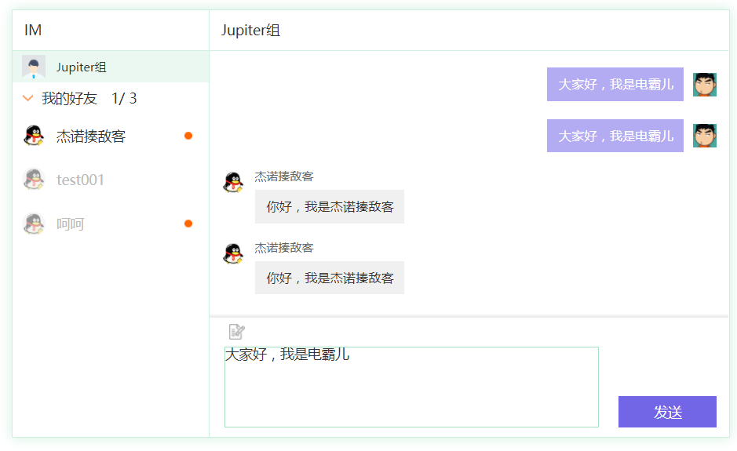

# startpoint

# startpoint是一个身份系统，提供用户、树形结构组、token等API。

### 答疑、问题反馈QQ群：537982451

### 基于grain RPC框架

https://github.com/dianbaer/grain

	grain-httpserver
	grain-mariadb
	grain-threadkeylock
	
	
### StartpointServer（目录结构）

	|--src.main.java（服务器代码）
		|--StartpointServer.properties---------------配置文件（需要修改）
		|--generatorConfig.xml--------------------mybatis自动生成配置文件（重新生成时，需要修改）
		|--org.startpoint
			|--server.Expand.java-------------------扩展启动类
			|--plugin.PaginationPlugin.java-------mybatis自动生成配置文件启动类
			
	|--protobuf（消息包生成工具）
	|--WebContent
		|--index.html（所有API示例）
		|--js（所有API示例依赖js）
		|--html（所有API示例依赖html）

		
### 接口调用界面示例（获取admintoken）

		
		
## 打版本：在项目根目录下，执行

	ant

## 配置：

dist/StartpointConfig/mybatis-config.xml---访问身份系统数据库

dist/StartpointServer.properties----StartpointConfig在服务器路径及一些配置

	#mybatis-config.xml在服务器的地址
	config_dir = C:/Users/admin/Desktop/github/Startpoint/trunk/StartpointConfig
	#身份系统的地址，本项目的服务器地址
	uCenterUrl = http://localhost:8080/StartpointServer/s

## 推荐环境：

>快捷部署 https://github.com/dianbaer/deployment-server

	jdk-8u121

	apache-tomcat-8.5.12

	MariaDB-10.1.22

	CentOS-7-1611

## 发布项目：

>1、安装数据库
	
	create database startpoint
	
	source ****/startpoint.sql

>2、将StartpointConfig放入服务器某个路径，例如
	
	/home/StartpointConfig

>3、将StartpointServer.properties放入tomcat根目录下，例如
	
	/home/tomcat/StartpointServer.properties
	
	并修改config_dir对应的StartpointConfig路径

>4、将StartpointServer.war放入tomcat/webapps，例如
	
	/home/tomcat/webapps/StartpointServer.war

	

## startpoint提供的API功能（除了获取token接口请求外，其他接口需要传admintoken）：

获取admintoken示例：

	var data = {
		'hOpCode': '20',
		'userName': 'admin',
		'userPassword': '123456'
	};
	var header = [];
	header["hOpCode"] = "20";
	var httpClient = new juggle.HttpClient();
	httpClient.send(data, "http://localhost:8080/StartpointServer/s", header);
	httpClient.addEventListener(juggle.httpEventType.SUCCESS, adminSuccess, this);
	httpClient.addEventListener(juggle.httpEventType.ERROR, adminError, this);

>1、用户组API（树形结构）：
	
	创建、修改、获取、删除用户组。
	获取用户组列表。

>2、用户API：
	
	创建、修改、获取用户。
	获取用户列表。
	根据邮箱获取用户、获取用户头像。
	检查用户名、手机是否存在。

>3、tokenAPI：
	
	登录通过用户名密码获取token
	更新token
	删除token

